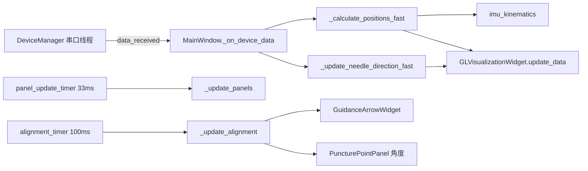

# Agent 开发文档 — needle_tracking（无配准版）

本文档供 **Cursor / Copilot 等编码 Agent** 在本仓库中改代码时阅读。人类用户请参阅 [README.md](README.md)。

---

## 1. 项目是什么

- **类型**：PyQt5 桌面应用（非 Web）
- **场景**：手术探针 / IMU 穿刺**训练**（角度对准），非临床导航
- **版本定位**：**无配准** — 不做 CT↔患者刚性配准；连接 IMU 后**针尖固定在 Entry**，仅根据四元数更新针体姿态与 IMU 位置
- **入口**：`main.py` → `ui.main_window.MainWindow`

### JetArm marker 实验线（支线，不接主窗口）

与 IMU 主路径**并行、独立**；代码在 `tools/jetarm_marker/`，数据在 `data/jetarm_marker/`。  
**主程序**不加载 `anchor_imu_needle.json`，针长仅来自 `config/imu_geometry.json` → `MainWindow.needle_length` → `gl_widget.needle_length`。  
支线进度：[docs/jetarm_marker/STATUS.md](docs/jetarm_marker/STATUS.md)。

---

## 2. 不要恢复的死代码（已删除）

以下模块已在 `b49e4fd` 前后移除，**除非用户明确要求**，不要重新引入或「顺便接回去」：

| 已删除 | 原因 |
|--------|------|
| `core/puncture_session.py` | 状态机从未 `start()`，与主流程重复 |
| `core/puncture_monitor.py` | 仅服务 session |
| `core/simulation_manager.py` | 主窗口未使用 |
| `core/trajectory_tracker.py` | IMU 积分位移，与本版「无配准」矛盾 |
| `core/ekf_filter.py` | 未接入 UI |
| `ui/widgets/projection_views.py` | 三视图已弃用 |

README 中若仍出现上述名称，以本文件与当前目录为准。

---

## 3. 目录与职责

```text
main.py                    # QApplication、高 DPI、加载 stylesheet.qss
core/
  device_manager.py        # 串口线程；帧 0x55；信号 data_received / connected
  dicom_loader.py          # DICOM → mesh；信号 loading_finished / progress_updated
  imu_kinematics.py        # 四元数 → 针轴（场景系）；tip ↔ IMU 位置
ui/
  main_window.py           # ★ 编排中心：信号、定时器、业务顺序
  widgets/
    gl_widget.py           # PyQtGraph OpenGL：针、CT、Entry/Target、路径虚线
    panels.py              # 左栏手风琴内容页；GuidanceArrowWidget（圆盘）
    workflow_stepper.py    # 顶栏四步状态条
    alignment_hud.py       # 右栏对准 HUD（圆盘 + 大角度）
    prep_sidebar.py        # 左栏深色手风琴（替代 QToolBox）
    ui_helpers.py          # QSS variant/role；configure_side_scroll / apply_panel_chrome
    simulation_panel.py    # 右栏路径引导 + 姿态锁定
    puncture_point_selector.py  # 3D 点击选点（trimesh BVH）
styles/stylesheet.qss      # 全局暗色主题（局部仍有内联 setStyleSheet）
```

**改功能时优先打开**：`ui/main_window.py` → 对应 `core/*` 或 `ui/widgets/*`。

---

## 4. 当前用户流程（唯一主路径）

```text
加载 DICOM (CTModelPanel)
  → 开始选择穿刺点 (PuncturePointPanel) → 3D 点击 (PuncturePointSelector)
  → 连接串口 (DeviceConnectionPanel)
  → 针尖锚定 Entry (gl_widget.set_needle_tip_position)
  → 计算 Entry→Target 方向 → alignment_timer + GuidanceArrowWidget + 穿刺面板角度
  → [可选] 右侧 SimulationPanel：引导模式 / 姿态锁定 → 3D 预设/目标路径虚线
```

**顺序约束**：未选穿刺点则连接设备会被断开（见 `_on_device_connected`）。

---

## 5. 数据流（Agent 必记）



| 数据 | 来源 | 用途 |
|------|------|------|
| `quaternion`, `euler` | 设备帧 0x59 / 0x53 | 显示、针向计算 |
| `needle_direction` | `needle_axis_scene_normalized(q)` | 对准、3D 针体 |
| `tip_pos` | 固定 Entry 或 `[0,0,0]` | 针尖显示 |
| `imu_pos` | `imu_position_from_tip(tip, dir, needle_length)` | 针尾 / IMU 盒 |
| `target_direction_world` | Entry→Target 单位向量 | 对准误差 |

**针长**：`config/imu_geometry.json` 的 `needle_length_mm` → `MainWindow.needle_length` → `gl_widget.needle_length`（`_sync_needle_length_to_gl`）；位置计算与固定针尖分支均用 `self.needle_length` / `gl_widget.needle_length`。

---

## 6. UI 布局（2025 精简后）

| 区域 | 内容 |
|------|------|
| 左栏（可滚动） | CT 导入 → 设备连接（含校准）→ IMU（欧拉/四元数、重置视角/清轨迹） |
| 中栏 | 全高 `GLVisualizationWidget` |
| 右栏（可滚动） | 对准引导标题 + 罗盘 → 穿刺点面板 → 路径引导面板 |

窗口启动：`MainWindow._apply_window_geometry()` 按屏幕可用区域约 **88%** 缩放并居中。

---

## 7. 信号连接入口

所有连接在 `MainWindow._connect_signals()`：

- **设备**：`connect_clicked` / `disconnect_clicked` / `calibration_clicked` / `data_received`
- **IMU 面板**：`reset_view_clicked` / `clear_trajectory_clicked`
- **CT**：`load_clicked` / `clear_clicked` / `visibility_changed`
- **DICOM**：`progress_updated` / `loading_finished` / `loading_failed`
- **穿刺点**：`start_selection_clicked` / `reselect_clicked`；`PuncturePointSelector.point_selected`
- **模拟**：`simulation_started` / `simulation_stopped` / `orientation_locked`

**不存在**：`puncture_session.*`、`path_selected`（除非重新实现）。

---

## 8. 硬件与协议

- **设备**：JY901S 类 IMU，串口 **115200**
- **帧**：头 `0x55`，11 字节，校验和为前 10 字节之和低 8 位
- **类型**：`0x51` 加速度，`0x52` 陀螺，`0x53` 欧拉，`0x59` 四元数
- **校准**：陀螺零偏（静止 ~150 样本）+ 磁力计命令 `FF AA`（见 `DeviceManager`）

---

## 9. 坐标与几何

- 针体在 IMU 体系参考方向：`_NEEDLE_BODY_IMU ≈ (√2/2, √2/2, 0)`（见 `core/imu_kinematics.py`）
- 映射到场景系：`needle_axis_scene_raw` 内对 x/y/z 做轴交换与取反 — **改硬件安装方式必须改此处**
- CT 加载后顶点会平移到近原点；Target 默认 `model center + [30, -25, 60]` mm

---

## 10. Agent 修改准则

1. **最小 diff**：只改与任务相关的文件；不要恢复已删模块「以备后用」。
2. **PyQt 线程**：串口只在 `DeviceManager` 线程读；UI 更新靠信号回到主线程。DICOM 用 `QThread` + `moveToThread`（注意重复加载生命周期）。
3. **样式**：新控件优先复用 `stylesheet.qss`；与现有 `panels.py` 卡片风格一致。
4. **无配准**：不要默认加 IMU 位移积分或「全空间轨迹」除非用户明确要求新版本。
5. **提交**：用户未要求时不要 `git commit`；文档与代码同步更新 README/本文件。
6. **测试**：无自动化测试；改完至少 `python main.py` 能启动，串口/DICOM 路径需用户本机验证。

---

## 11. 常见任务 → 改哪里

| 任务 | 文件 |
|------|------|
| 串口/解析/校准 | `core/device_manager.py` |
| 针向/针长几何 | `core/imu_kinematics.py`, `MainWindow._calculate_positions_fast` |
| 对准逻辑/罗盘 | `MainWindow._update_alignment`, `panels.GuidanceArrowWidget` |
| 3D 显示/相机/路径线 | `ui/widgets/gl_widget.py` |
| 选穿刺点 | `puncture_point_selector.py`, `MainWindow._on_puncture_*` |
| CT 加载性能/质量 | `core/dicom_loader.py` |
| 新按钮/面板 | `panels.py` + `main_window` 布局与 `_connect_signals` |
| Target 可交互选择 | `PuncturePointPanel` + `PuncturePointSelector.MODE_TARGET` + `main_window._on_*_target*` |

---

## 12. 运行与环境

```bash
pip install PyQt5 numpy pyserial pydicom scikit-image trimesh pyqtgraph PyOpenGL
python main.py
```

- **OS**：主要面向 Windows（串口 `COM*`）
- **显示**：高 DPI 在 `main.py` 中启用 `AA_EnableHighDpiScaling`
- **工作区路径**可能含中文（如 `needle_tracking 无配准`）；终端/工具需支持 UTF-8

---

## 13. 与用户沟通

- 用户可能把「左侧」说成「右侧」；以**实际布局**（CT/设备在左，对准在右）为准。
- 「可视化窗口太大」→ `_apply_window_geometry`、侧栏 `maximumWidth`、去掉底部占位子面板。
- 若要求「配准版」，应新开分支/目录，勿在本仓库默认启用位移跟踪。

---

## 14. 文档版本

- 对齐 git：`master` 上 README + 无 `puncture_session` / 三视图 之后的结构
- 若目录与本文冲突，以 **仓库实际文件** 为准，并应更新本文档
